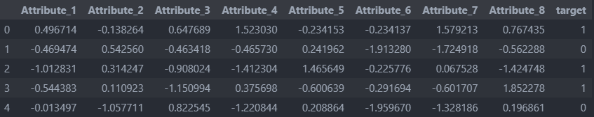
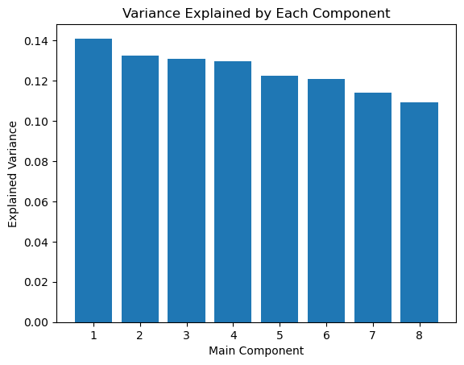
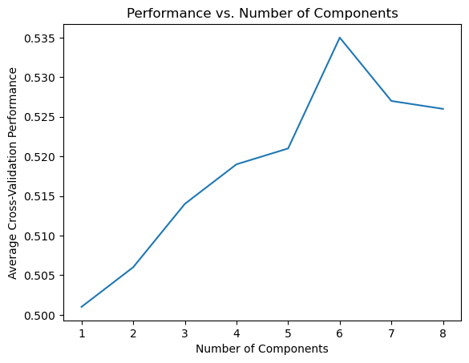
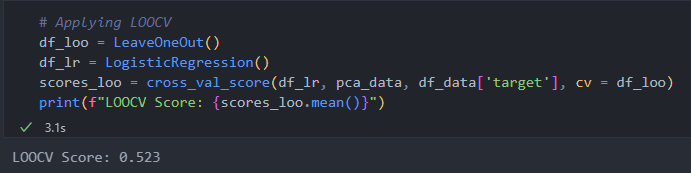
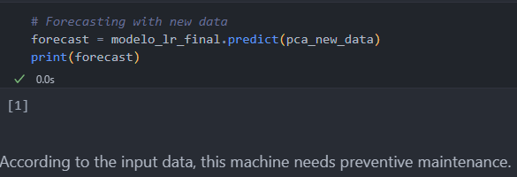

# Machines_Predict_PCA
Applying PCA and Logistic Regression to data industrial machines to provide maintenance.

Dataset: ficticius data sensors machine - 1000 rows with target.

### Pre-processing:
* StandScaler

### Find Most relevant variables:
* Principal component analysis (PCA)

### Model Prediction:
* Logistic Regression

### Cross Validation
*  LeaveOneOut (LOOCV)

### Results

### Simulation:

